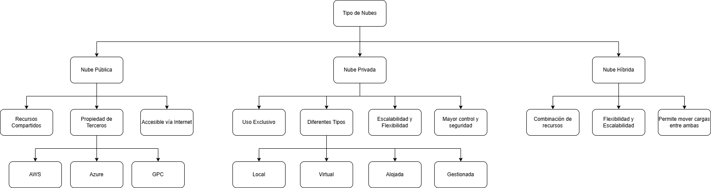

# 🌩️ Mapa Conceptual: Tipos de Nubes

Este mapa conceptual explica los **tipos de despliegue de servicios en la computación en la nube**, mostrando sus características y diferencias.

## 🧭 Descripción general

En la computación en la nube, existen tres tipos principales de nubes según su modelo de implementación:

### ☁️ Nube Pública
- Es ofrecida por proveedores externos como AWS, Azure o Google Cloud.
- La infraestructura se comparte entre varios usuarios o clientes.
- Accesible a través de internet.
- Escalable y de bajo costo inicial.
- Ejemplo: uso de servicios como almacenamiento en Amazon S3.

### 🏢 Nube Privada
- Infraestructura dedicada exclusivamente a una organización.
- Mayor control sobre la seguridad, privacidad y personalización.
- Puede estar ubicada físicamente en la empresa o gestionada por un proveedor externo.
- Más costosa y compleja de mantener.

### 🔄 Nube Híbrida
- Combinación de nube pública y privada.
- Permite mover datos y aplicaciones entre ambas según necesidades.
- Ideal para empresas que manejan información sensible pero también requieren escalabilidad.

## 🖼️ Representación visual

A continuación se muestra el mapa conceptual correspondiente:

> 💡 Este mapa ayuda a entender cómo se clasifican las nubes y qué características diferencian a cada tipo, facilitando la toma de decisiones en proyectos tecnológicos.

---

